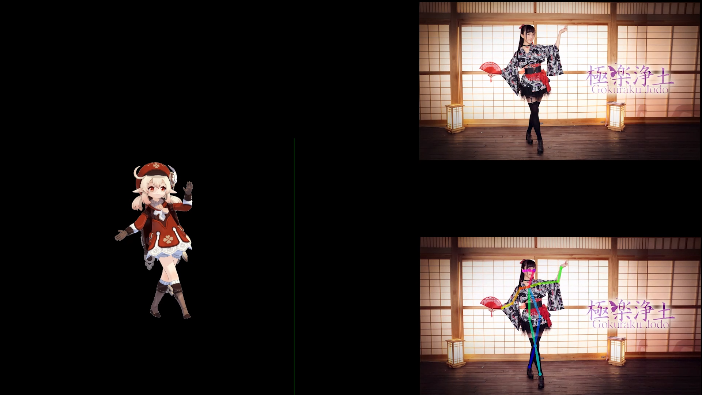

# 自动根据视频生成MMD动作文件
> 本项目没有任何自己原创的部分（因为已经有现成的了）这里只是简单介绍一下项目如何使用以及项目的原理
## 视频文章
[B站]()<br>
[YouTube]()<br>
[掘金]()
## 效果展示

## 项目运行
原项目地址：https://github.com/huahuahuage/OpenMMD

原项目的依赖可能有些安装不上，这里可以使用本仓库的requirements.txt

还有项目最好使用python3.7的，使用3.9的话TensorFlow会安装不上。。
```shell
# 自己按照原来的项目去下载模型和openpose文件，然后安装依赖运行就可以了，使用非常简单
pip install -r requirements.txt
python launch.py
```

## 原理介绍

[点击跳转](./study.md)

## 相关问题
### TensorFlow安装不上可以使用下面这个命令来安装
```shell
pip install tensorflow==1.13.1 -i https://pypi.tuna.tsinghua.edu.cn/simple
```

### CMake must be installed to build dlib
因为你电脑没有安装cmake，请自行安装，安装地址：https://cmake.org/download/

### protobuf安装包问题
错误信息如下
```
TypeError: Descriptors cannot not be created directly.
If this call came from a _pb2.py file, your generated code is out of date and must be regenerated with protoc >= 3.19.0.
If you cannot immediately regenerate your protos, some other possible workarounds are:
 1. Downgrade the protobuf package to 3.20.x or lower.
 2. Set PROTOCOL_BUFFERS_PYTHON_IMPLEMENTATION=python (but this will use pure-Python parsing and will be much slower).
```
这个是protobuf版本的问题，可以安装下面这个
```shell
pip install protobuf==3.19.0
```
