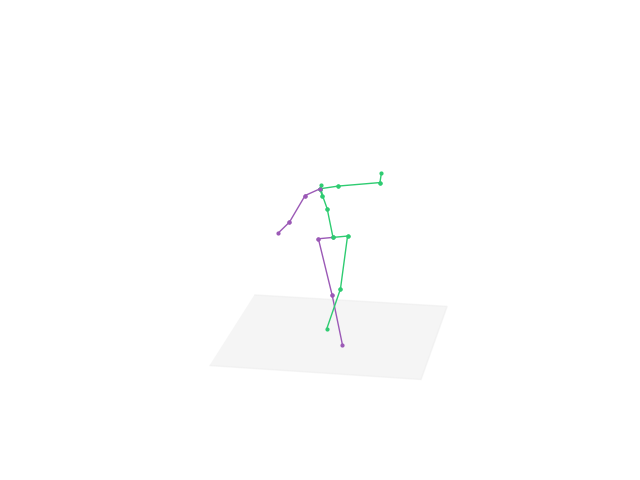
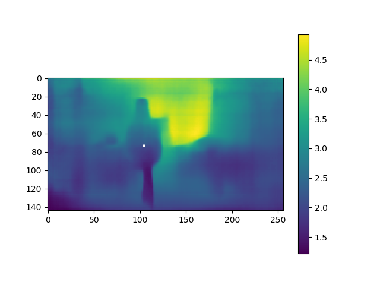
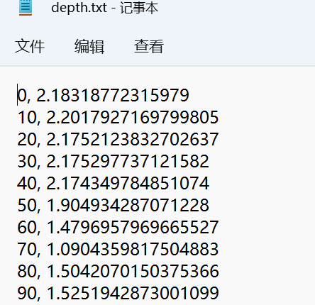
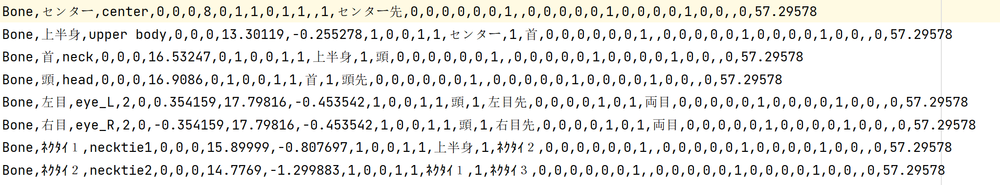

# 原理简单介绍
项目主要分成以下几步
## 视频姿态识别
第一部分是提取出视频里面的动作信息
这里使用的[openpose](https://github.com/CMU-Perceptual-Computing-Lab/openpose)这个项目,目前这个项目在github有25k star

主要的核心代码就是下面这部分，这里其实就是调用了openpose来生成动作信息
```shell
# OpenPose组件相关路径
openpose_path = os.path.join(work_dir, "utils/openpose/bin/OpenPoseDemo.exe")
openpose_write_json_path = os.path.join(video_dir, "_json")
openpose_write_video_path = os.path.join(video_dir, "_openpose.avi")

# 运行组件
os.chdir(os.path.join(work_dir, "utils/openpose"))
cmd_part_1 = "{} --model_pose COCO --video {} --write_json {} --write_video {} --number_people_max 1 --net_resolution \"-1x240\"".format(openpose_path, video_path, openpose_write_json_path, openpose_write_video_path)
os.system(cmd_part_1)
os.chdir(work_dir)
```

我们可以看一下json的内容，其实就是一堆坐标点（每一帧都有一个json文件）
```json
{"version":1.3,"people":[{"person_id":[-1],"pose_keypoints_2d":[516.183,157.359,0.965886,495.35,226.672,0.894758,455.993,232.744,0.814519,419.86,302.161,0.661659,389.612,323.369,0.366841,543.449,211.66,0.842323,630.887,202.454,0.793637,643.068,139.28,0.830431,498.183,371.487,0.727788,522.463,495.224,0.748898,546.481,621.947,0.70364,546.511,362.499,0.68047,522.464,495.231,0.70542,498.347,591.737,0.705498,498.184,151.241,0.929691,519.331,151.271,0.936586,471.082,154.305,0.999959,0,0,0],"face_keypoints_2d":[],"hand_left_keypoints_2d":[],"hand_right_keypoints_2d":[],"pose_keypoints_3d":[],"face_keypoints_3d":[],"hand_left_keypoints_3d":[],"hand_right_keypoints_3d":[]}]}
```

## 生成3D姿态平面数据

原始项目地址：https://github.com/una-dinosauria/3d-pose-baseline

简单来说就是生成下面这种图，以及把姿态数据提取出来

姿态数据如下
```text
516.178 157.36149999999998 495.3515 226.665 455.998 232.72750000000002 419.86350000000004 302.1445 380.58000000000004 323.281 543.4515 211.661 630.8705 202.44850000000002 643.069 139.2785 498.20050000000003 371.48400000000004 522.4615 495.226 546.4755 621.9404999999999 546.5125 362.4925 522.4545 495.2335 498.346 591.741 498.17949999999996 151.24450000000002 519.328 151.2745 471.0795 154.3055 0.0 0.0
```

## 姿态数据深度推定

原始项目地址：https://github.com/iro-cp/FCRN-DepthPrediction#results

这里一步会生成深度信息，就是下面这种


深度信息的结果如下



## 生成vmd动作文件

这里就是最后一步了，这里会根据前面的的动作信息和深度信息来生成最后的mmd文件

代码的第一行就是在读取初音的骨骼信息
```python
def run(target, verbose, centerxy, centerz, xangle, ddecimation, mdecimation, idecimation, alignment, legik, heelpos):
    bone = os.path.join(os.getcwd(), "data/born/animasa_miku_born.csv")
    upright = 0
```
骨骼信息如下

主要是各个骨骼的一些坐标，可以看到这个骨骼是根据miku的模型来生成的，所以可能对其他模型不适用

另外vmd动作文件内容网上有一篇不错的的文章介绍，感兴趣的可以看下：https://www.jianshu.com/p/ae312fb53fc3


